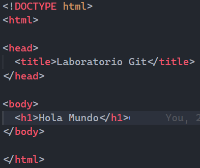
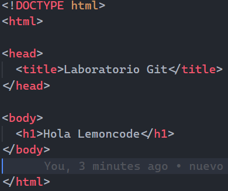

# Laboratorio Git - Objetivos

### Objetivo 1 - Crear un repositorio en local

1. mkdir modulo_0
2. cd modulo_0
3. mkdir laboratorio_git
4. cd laboratorio_git
5. git init

### Objetivo 2 - Subir el repositorio a GitHub

1. 
2. git remote add origin git@githubcom:pablorod1/laboratorio_git.git
3. git status
   

### Objetivo 3 - Hacer un commit y un push

1. 
2. git add .
3. git commit -m "nuevo index.html"
4. git push -u origin master

### Objetivo 4 - Crear una rama

1. git branch development
2. git checkout development
3.  
4. git add .
5. git commit -m "cambios index.html"
6. git push -u origin development

### Objetivo 5 - Hacer un merge

1. git checkout master
2. git merge development
3. git push -u origin master
