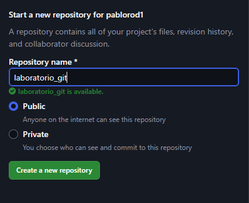
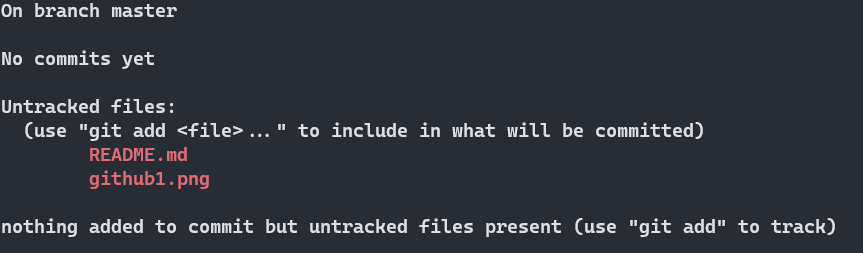
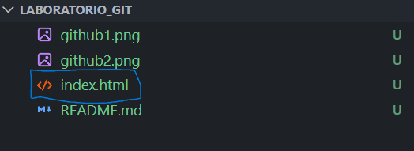

# Laboratorio Git - Objetivos

### Objetivo 1

1. mkdir modulo_0
2. cd modulo_0
3. mkdir laboratorio_git
4. cd laboratorio_git
5. git init

### Objetivo 2

1. 
2. git remote add origin git@githubcom:pablorod1/laboratorio_git.git
3. git status
   

### Objetivo 3

1. 
